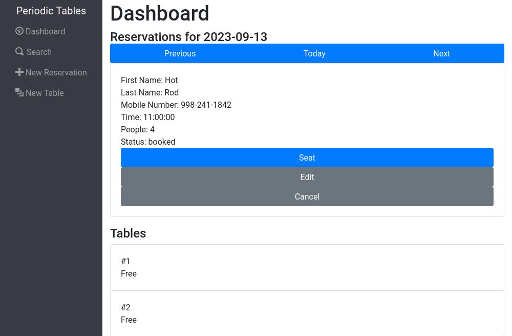
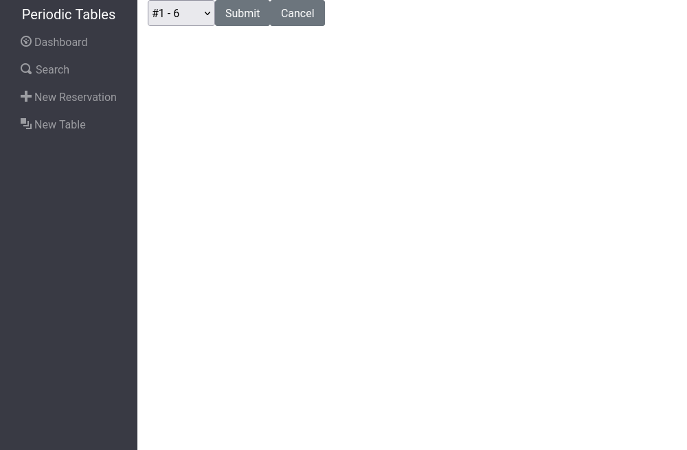
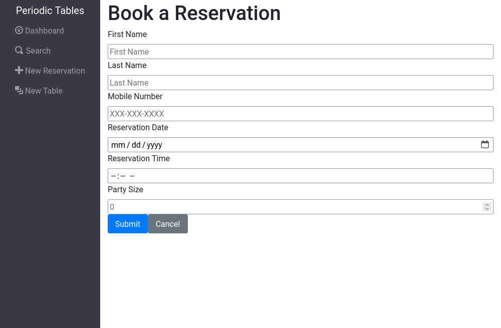
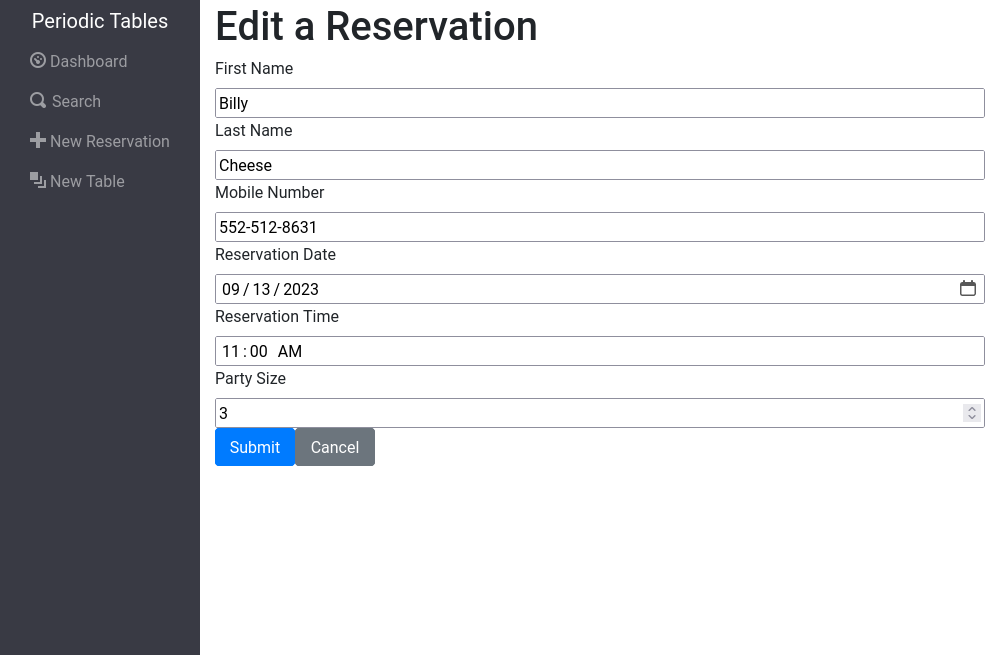
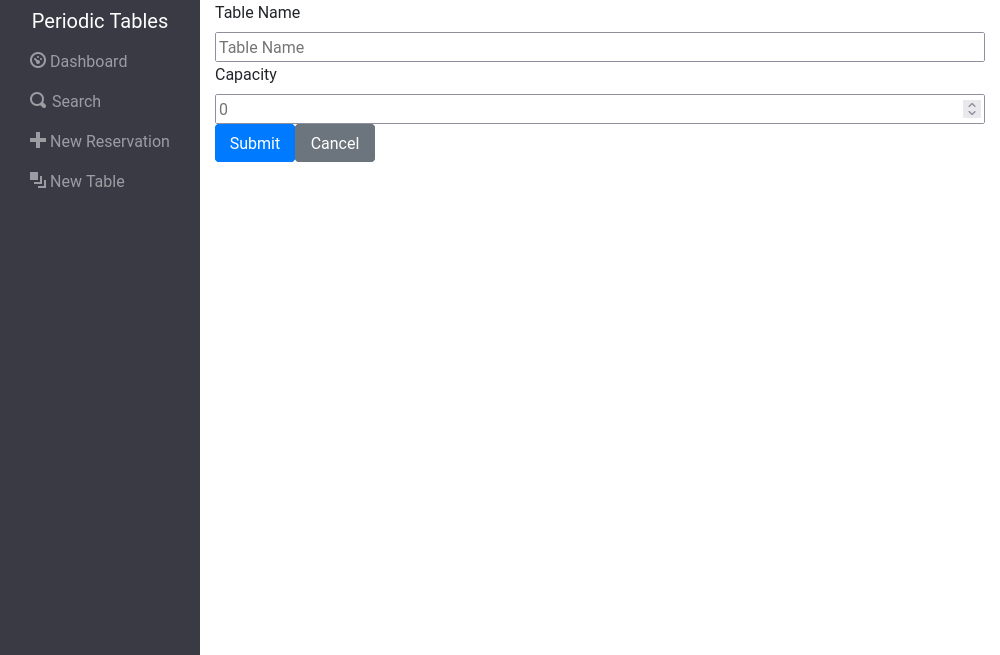
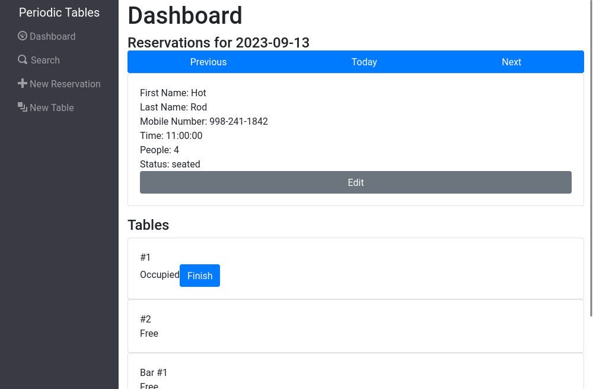
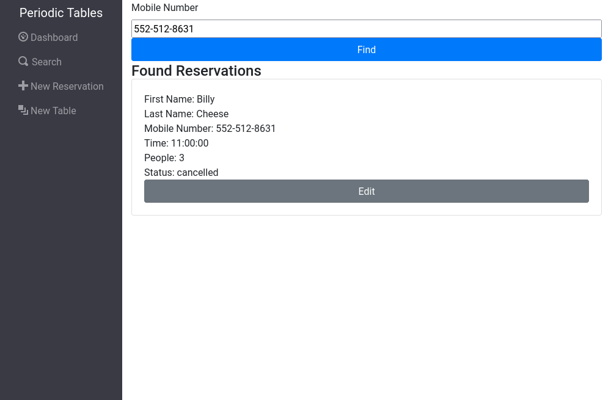
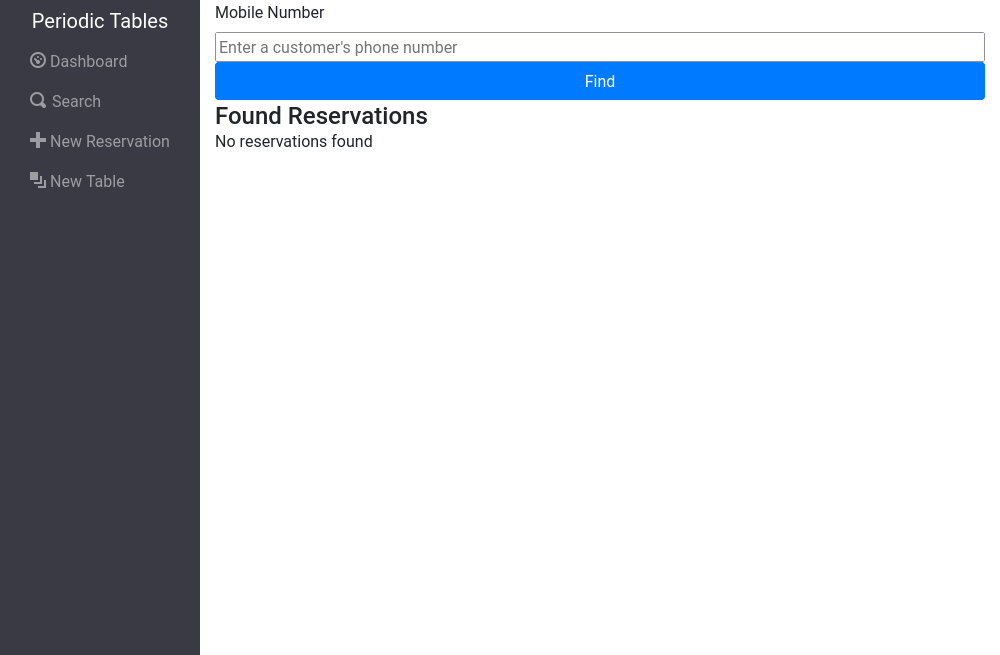

# Restaurant Reservation System

## Summary

This project is a reservation management system for a fictional company Periodic Tables. Staff can create and edit reservations, create tables, seat reservations and search for reservations by their associated mobile number.

The dashboard will display all reservations for the current selected date. Staff can change the viewing date with the Previous, Next, and Today buttons.
New reservations will automatically be set to a status of booked.

Booked reservations can also be cancelled by pressing the Cancel button beneath them.

Pressing the Seat button on a booked reservation will bring the user to the reservation seat page.

When creating a new reservation, the backend will perform validation on each key in the form data automatically and display an error if there are any. 

Validation also occurs when creating a new table.

When a table is no longer in use, the Finish button can be clicked to remove its association with a reservation, and the reservation will automatically be marked finished and hidden from the dashboard.

When searching for a reservation, the user can enter part of a mobile number and still receive results.

If no reservations are found, the page will display 'No reservations found'.

## Technologies

This project makes use of several frontend and backend technologies.
For the frontend, bootstrap, react, and react-router were used for styling, rendering, and routing, respectively.
For the backend, express, knex, and a postgres db were used for routing, query building, and storing data, respectively.

## File structure

The table below describes the folders in this repository:

| Folder/file path | Description                                                      |
| ---------------- | ---------------------------------------------------------------- |
| `./back-end`     | The backend project, which runs on `localhost:5001` by default.  |
| `./front-end`    | The frontend project, which runs on `localhost:3000` by default. |

### Backend files

The `./back-end` folder contains all the code for the backend project.

| Folder/file path                                         | Description                                                                                                         |
| -------------------------------------------------------- | ------------------------------------------------------------------------------------------------------------------- |
| `./back-end/knexfile.js`                                 | The Knex configuration file.                                                                                        |
| `./back-end/src/app.js`                                  | Defines the Express application and connects routers.                                                               |
| `./back-end/src/db/connection.js`                        | The Knex connection file.                                                                                           |
| `./back-end/src/db/migrations/`                          | The Knex migrations folder.                                                                                         |
| `./back-end/src/db/seeds/`                               | The Knex seeds folder.                                                                                              |
| `./back-end/src/errors/errorHandler.js`                  | Defined an Express API error handler.                                                                               |
| `./back-end/src/errors/notFound.js`                      | Defined an Express API "not found" handler.                                                                         |
| `./back-end/src/reservations/reservations.router.js`     | A router for the reservations resource.                                                                             |
| `./back-end/src/reservations/reservations.controller.js` | A controller for the reservations resource.                                                                         |
| `./back-end/src/reservations/reservations.service.js`    | A service that communicates with the reservations table through Knex queries.                                       |
| `./back-end/src/tables/tables.router.js`                 | A router for the tables resource.                                                                                   |
| `./back-end/src/tables/tables.controller.js`             | A controller for the tables resource.                                                                               |
| `./back-end/src/tables/tables.service.js`                | A service that communicates with the tables table through Knex queries.                                             |
| `./back-end/src/server.js`                               | Defines the node server.                                                                                            |
| `./back-end/test/`                                       | A folder that contains all of the integration tests.                                                                |
| `./back-end/vercel.json`                                 | A vercel deployment configuration file.                                                                             |

### Frontend files

The `./front-end` folder contains all the code for the frontend project.

| Folder/file path                                   | Description                                                                                            |
| -------------------------------------------------- | ------------------------------------------------------------------------------------------------------ |
| `./front-end/e2e`                                  | Contains all of the end-to-end tests.                                                                  |
| `./front-end/jest-puppeteer.config.js`             | A configuration file used by the end-to-end tests.                                                     |
| `./front-end/src/App.js`                           | Defines the root application component.                                                                |
| `./front-end/src/App.test.js`                      | Contains the tests for the root application component.                                                 |
| `./front-end/src/dashboard/Dashboard.js`           | Defines the Dashboard page.                                                                            |
| `./front-end/src/index.js`                         | The main entry point for the React application.                                                        |
| `./front-end/src/layout/ErrorAlert.js`             | Defines an error alert component that display only when an error is specified.                         |
| `./front-end/src/layout/Layout.css`                | The CSS for the Layout component.                                                                      |
| `./front-end/src/layout/Layout.js`                 | Defines the main layout of the application.                                                            |
| `./front-end/src/layout/Menu.js`                   | Defines the menu for the application.                                                                  |
| `./front-end/src/layout/NotFound.js`               | Defines the "Not found" component that is displayed when no route matches.                             |
| `./front-end/src/layout/Routes.js`                 | Defines all the routes for the application.                                                            |
| `./front-end/src/reservations/Reservation.js`      | Defines a single reservation component.                                                                |
| `./front-end/src/reservations/ReservationForm.js`  | Defines the reservation creation form component.                                                       |
| `./front-end/src/reservations/ReservationSeat.js`  | Defines the reservation seating form component.                                                        |
| `./front-end/src/reservations/ReservationList.js`  | Defines the reservation list component.                                                                |
| `./front-end/src/tables/Table.js`                  | Defines a single table component.                                                                      |
| `./front-end/src/tables/TableForm.js`              | Defines the table creation form component.                                                             |
| `./front-end/src/tables/TableSelect.js`            | Defines the table select component for the reservation seating form component.                         |
| `./front-end/src/tables/TablesList.js`             | Defines the table list component.                                                                      |
| `./front-end/src/search/Search.js`                 | Defines the search form component.                                                                     |
| `./front-end/src/utils/api.js`                     | Defines the functions used to access the backend API                                                   |
| `./front-end/src/utils/useQuery.js`                | Defines a custom hook to parse the query parameters from the URL.                                      |

## API

The API consists of two main routes to send requests to

| Path             | Description                                                      |
| ---------------- | ---------------------------------------------------------------- |
| `/reservations`  | Route dealing with reservation data                              |
| `/tables`        | Route dealing with table data                                    |

## Reservations API

| Path                                      | Description                                                          |
| ----------------------------------------- | -------------------------------------------------------------------- |
| `/reservations/` GET                      | Lists all reservations. Accepts ?date and ?mobile_number queries.    |
| `/reservations/` POST                     | Creates a new reservation. Validates all data sent in the body.      |
| `/reservations/:reservationId` GET        | Returns a specific reservation based on :reservationId.              |
| `/reservations/:reservationId` PUT        | Updates a specific reservation. Validates all data sent in the body. |
| `/reservations/:reservationId` DELETE     | Deletes a specific reservation.                                      |
| `/reservations/:reservationId/status` PUT | Updates a specific reservation's status.                             |

## Tables API

| Path                                | Description                                                                                     |
| ----------------------------------- | ----------------------------------------------------------------------------------------------- |
| `/tables/` GET                      | Lists all tables.                                                                               |
| `/tables/` POST                     | Creates a new table. Validates all data sent in the body.                                       |
| `/tables/:tableId` GET              | Returns a specific table based on :tableId.                                                     |
| `/tables/:tableId` PUT              | Updates a specific table. Validates all data sent in the body.                                  |
| `/tables/:tableId` DELETE           | Deletes a specific table.                                                                       |
| `/tables/:tableId/seat` PUT         | Updates a specific table's assignment to a reservation based on the reservation_id in the body. |
| `/tables/:tableId/seat` DELETE      | Delete a specific tablea's assignment to a reservation.                                         |

## Installation

1. Fork and clone this repository.
1. Run `cp ./back-end/.env.sample ./back-end/.env`.
1. Update the `./back-end/.env` file with the connection URL's to your database instance.
1. Run `cp ./front-end/.env.sample ./front-end/.env`.
1. You should not need to make changes to the `./front-end/.env` file unless you want to connect to a backend at a location other than `http://localhost:5001`.
1. Run `npm install` to install project dependencies.
1. Run `npm run start:dev` to start your server in development mode.